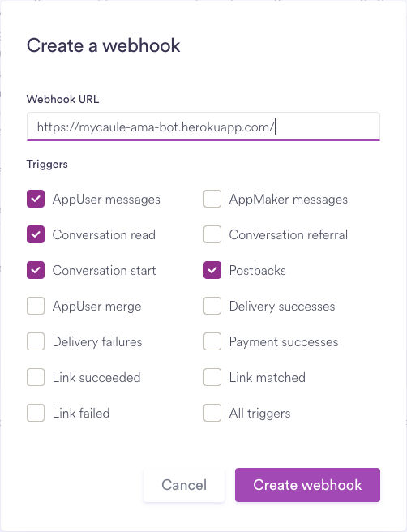
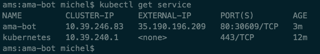

# AskMeAnything bot
Bot ask for asking me anything.

[Demo](https://mycaule-ama-bot.herokuapp.com/) | [Blog post](https://mycaule.github.io/2017/10/24/chatbot/)


Ready for production chatbot with integrated SaaS backoffices.

The application use this stack : Smooch.io + Dialogflow + GitHub Issues + Node.js + Docker.

## Setup

1. Configure the following two Smooch integration in their web interface: Web messenger, Webhooks

2. Create an agent using Dialogflow and plug-in the Smalltalk option.

3. Fill in the secrets file with API keys `config/secrets.json`.

4. Install this app and run it!

| Domain     | Key name             | Documentation                                                                              |
|------------|----------------------|--------------------------------------------------------------------------------------------|
| DialogFlow | `clientAccessToken`  | In the Agent General properties, refer to the API keys section                             |
| Smooch     | `appId`              | `appId` can be found in the homepage `https://app.smooch.io/apps/{appId}`                  |
| Smooch     | `keyId`              | Generate this in the Secrets keys section of `https://app.smooch.io/apps/{appId}/settings` |
| Smooch     | `secretKey`          | Generate this in the Secrets keys section of `https://app.smooch.io/apps/{appId}/settings` |

## Running the code locally

```
# Install node dependencies
npm install

# App will be running on port 3000
nodemon app.js

# Optional, generate a public URL with ngrok tunnel
ngrok http 3000
```

You also have to configure Smooch webhook url with the public url at this point. You can create one using [ngrok](https://ngrok.com) for example.

See [Smooch - Receiving Messages](https://docs.smooch.io/guide/receiving-messages/).

## Running the code on production

I use Docker to put the application inside a container so that it can be deployed to any cloud platform you like. Application containers have the advantage to be language agnostic for the host and they provide standard operations to deploy, run and monitor your apps.

See [Google - Scalable Microservices with Kubernetes](https://www.udacity.com/course/scalable-microservices-with-kubernetes--ud615)

### Deploy locally

```
# Rebuilding the image
docker build -t mycaule/ama-bot .
```

```
# Listing images
docker images

# Make sure to have the secrets.json locally
vi config/secrets.json

# Running the image with a redirection to local port 8080
docker run -p 8080:3000 -v $PWD/config:/usr/src/app/config -d mycaule/ama-bot

# In production
# docker run -e "NODE_ENV=production" --rm -it --init -m "300M" --memory-swap "1G" -p 80:3000 -v $PWD/config:/usr/src/app/config --name "ama-bot" -d mycaule/ama-bot

# Listing docker processes
docker ps

# Printing app output
docker logs <container id>

# Enter the container
docker exec -it <container id> /bin/sh
```

See [Dockerizing a Node.js web app](https://nodejs.org/en/docs/guides/nodejs-docker-webapp/).

### Deploy using Heroku

Run the following commands to deploy the Docker image to Heroku.

```
heroku container:login
heroku create
heroku container:push web
```

Please note that Heroku does not support the following Dockerfile commands: `EXPOSE`, `VOLUME`. Hence, the HTTP port is defined by Heroku and the config variables have to be defined using `heroku config:set` command or on their interface.
To do so, please have the following variables defined in `process.env` context: `dialogflow_clientAccessToken`, `smooch_appId`, `smooch_keyId`, `smooch_secretKey`.

See [Heroku - Container Registry & Runtime](https://devcenter.heroku.com/articles/container-registry-and-runtime) and [Heroku - Configuration and Config Vars](https://devcenter.heroku.com/articles/config-vars)

### Configure Smooch with production URL



### Deploy using App Engine

[Demo](https://askmeanything-f8d1c.appspot.com)

[Configure docker for Cloud Repositories](Configure docker for Cloud Repositories):
```
gcloud components install docker-credential-gcr
docker-credential-gcr configure-docker
```

```
gcloud app deploy --project ama-bot app.yaml
```

The environment variables are defined in `env_variables` section of `app.yaml` file.
Create one using the template found in `/config/app.template.yaml`.

See [Google - Configuring your App with app.yaml](https://cloud.google.com/appengine/docs/flexible/custom-runtimes/configuring-your-app-with-app-yaml).

### Deploy using Cloud Container Engine

This method is for deploying the Docker image on *Google Cloud Platform*.

### TODO
- [ ] How to handle volumes with `kubectl`?

Make sure to have a *Compute Engine* instance first, if you don't check [this](http://mycaule.github.io/2017/10/19/scalable-microservices-lesson2/) and [this](http://mycaule.github.io/2017/10/20/scalable-microservices-lesson3/) posts.

```
# Upload the docker image to Container Registry
export PROJECT_ID="$(gcloud config get-value project -q)"
docker build -t gcr.io/${PROJECT_ID}/ama-bot .

# Create a new cluster
gcloud container clusters create k0
gcloud components install kubectl

# List available instances
gcloud compute instances list

# Deploy the application
kubectl run ama-bot --image=gcr.io/${PROJECT_ID}/ama-bot --port 8080

# List available deployments
kubectl get pods

# Expose the application
kubectl expose deployment ama-bot --type=LoadBalancer --port 80 --target-port 8080

# List available exposed services, EXTERNAL-IP
kubectl get services
```



See [Google - Deploying a containerized web application](https://cloud.google.com/container-engine/docs/tutorials/hello-app).

## Routes

Available HTTP routes are:
- `GET /`: A web interface for the chatbot,
- `POST /`: A webhook implementing Smooch and Dialogflow REST API calls.

## TODO
- [x] Implement a webchat bot on Smooch.io
- [x] [Dialogflow](https://dialogflow.com) and Smalltalk Intent
- [ ] Internet Knowledge for questions off topic
  - Google Answer box
  - [DuckDuckGo Instant Answer API](https://duckduckgo.com/api)
  - [Wolfram API](https://products.wolframalpha.com/api/)
- [ ] [Google API](https://www.npmjs.com/package/googleapis)
  - Calendar integration
- [ ] Orchestrate the different microservices with GraphQL.
- [ ] Fill in [Github Issue](https://developer.github.com/v3/issues/) for unanswered questions like in [sindresorhus/ama](https://github.com/sindresorhus/ama):
   - Node.js lib: https://www.npmjs.com/package/github
- [x] Deployment methods:
  - [x] Deploy application on Heroku
  - [x] Deploy packaged application on Cloud Container Engine
  - [ ] Optional: Deploy serverless application on Cloud Functions
