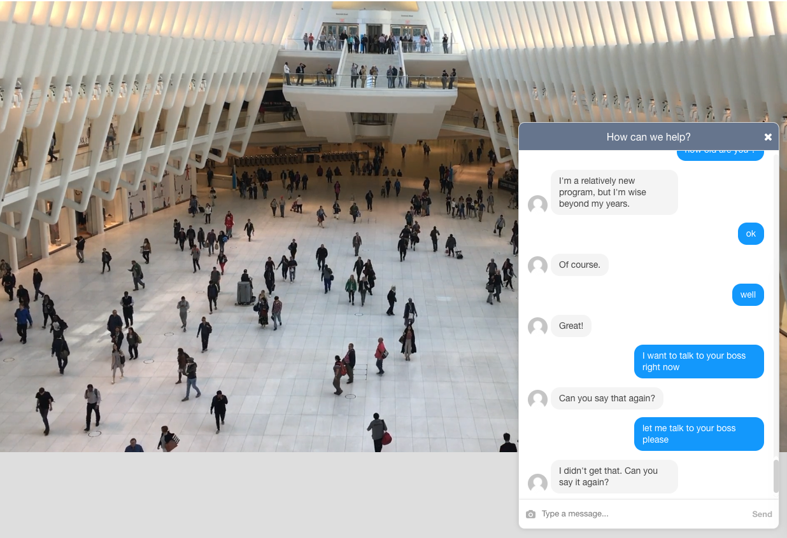

# AskMeAnything bot
Bot ask for asking me anything.

[Demo](https://mycaule-ama-bot.herokuapp.com/) | [Blog post](https://mycaule.github.io/2017/10/24/chatbot/)



Ready for production chatbot with integrated SaaS backoffices.

The application use this stack : Smooch.io + Dialogflow + GitHub Issues + Node.js + Docker.

## Setup

1. Configure the following two Smooch integration in their web interface: Web messenger, Webhooks

2. Create an agent using Dialogflow and plug-in the Smalltalk option.

3. Fill in the secrets file with API keys `config/secrets.json`.

4. Install this app and run it!

| Domain     | Key name             | Documentation                                                                              |
|------------|----------------------|--------------------------------------------------------------------------------------------|
| DialogFlow | `clientAccessToken`  | In the Agent General properties, refer to the API keys section                             |
| Smooch     | `appId`              | `appId` can be found in the homepage `https://app.smooch.io/apps/{appId}`                  |
| Smooch     | `keyId`              | Generate this in the Secrets keys section of `https://app.smooch.io/apps/{appId}/settings` |
| Smooch     | `secretKey`          | Generate this in the Secrets keys section of `https://app.smooch.io/apps/{appId}/settings` |

## Running the code locally

```
# Install node dependencies
npm install

# App will be running on port 3000
nodemon app.js

# Optional, generate a public URL with ngrok tunnel
ngrok http 3000
```

You also have to configure Smooch webhook url with the public url at this point. You can create one using [ngrok](https://ngrok.com) for example.

See [Smooch - Receiving Messages](https://docs.smooch.io/guide/receiving-messages/).

## Running the code on production

I use Docker to put the application inside a container so that it can be deployed to any cloud platform you like.

### Creating a Docker image

```
# Rebuilding the image
docker build -t mycaule/ama-bot .
```

```
# Listing images
docker images

# Make sure to have the secrets.json locally
vi config/secrets.json

# Running the image with a redirection to local port 80
docker run -p 80:3000 -v </full/local/path/to/config>:/usr/src/app/config -d mycaule/ama-bot

# Listing docker processes
docker ps

# Printing app output
docker logs <container id>

# Enter the container
docker exec -it <container id> /bin/bash
```

See [Dockerizing a Node.js web app](https://nodejs.org/en/docs/guides/nodejs-docker-webapp/).

### Deploy using Heroku

Run the following commands to deploy the Docker image to Heroku.

```
heroku container:login
heroku create
heroku container:push web
```

Please note that Heroku does not support the following Dockerfile commands: `EXPOSE`, `VOLUME`. Hence, the HTTP port is defined by Heroku and the config variables have to be defined using `heroku config:set` command or on their interface.
To do so, please have the following variables defined in `process.env` context: `dialogflow_clientAccessToken`, `smooch_appId`, `smooch_keyId`, `smooch_secretKey`.

See [Heroku - Container Registry & Runtime](https://devcenter.heroku.com/articles/container-registry-and-runtime) and [Heroku - Configuration and Config Vars](https://devcenter.heroku.com/articles/config-vars)

### Configure Smooch with production URL


### Deploy using Google Cloud Container Engine / Kubernetes

TODO. See this [blog post from me](http://mycaule.github.io/2017/10/19/scalable-microservices-lesson2/).

## Routes

Available HTTP routes are:
- `GET /`: A web interface for the chatbot,
- `POST /`: A webhook implementing Smooch and Dialogflow REST API calls.

## TODO
- [x] Implement a webchat bot on Smooch.io
- [x] [Dialogflow](https://dialogflow.com) and Smalltalk Intent
- [ ] Internet Knowledge for questions off topic
  - Google Answer box
  - [DuckDuckGo Instant Answer API](https://duckduckgo.com/api)
  - [Wolfram API](https://products.wolframalpha.com/api/)
- [ ] [Google API](https://www.npmjs.com/package/googleapis)
  - Calendar integration
- [ ] Orchestrate the different microservices with GraphQL.
- [ ] Fill in [Github Issue](https://developer.github.com/v3/issues/) for unanswered questions like in [sindresorhus/ama](https://github.com/sindresorhus/ama):
   - Node.js lib: https://www.npmjs.com/package/github
- [x] Deployment methods:
  - [x] Deploy application on Heroku
  - [x] Deploy packaged application on Cloud Container Engine
  - [ ] Optional: Deploy serverless application on Cloud Functions
